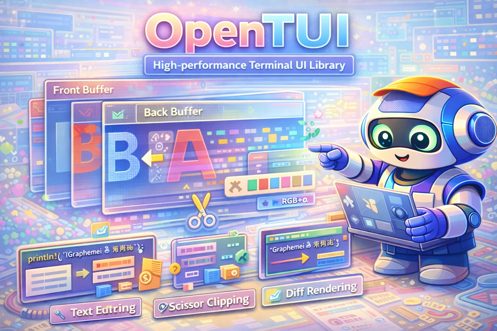

# OpenTUI Rust

<div align="center">
  
</div>

<div align="center">

[](LICENSE)
[](https://www.rust-lang.org)
[](https://doc.rust-lang.org/edition-guide/)
[](https://codecov.io/gh/Dicklesworthstone/opentui_rust)

*A Rust port of [anomalyco/opentui](https://github.com/anomalyco/opentui) (TypeScript), with native Rust performance and extended features.*

</div>

**High-performance terminal UI library with alpha blending, scissoring, and double-buffered rendering.**

```bash
# Add to your project
cargo add opentui_rust
```

---

## TL;DR

### The Problem

Building terminal UIs in Rust means choosing between:
- **High-level frameworks** (ratatui, cursive) that are opinionated and heavy
- **Low-level crates** (crossterm, termion) that require manual buffer management
- Neither offers true alpha blending, layered composition, or sub-millisecond rendering

### The Solution

OpenTUI is a **rendering engine**, not a framework. It gives you:
- Cell-based buffers with **real RGBA alpha blending**
- **Scissor clipping** for nested viewports
- **Double-buffered rendering** with diff detection (only changed cells update)
- **Rope-based text editing** with undo/redo
- **Zero opinions** about your application structure

### Why OpenTUI?

| Feature | OpenTUI | ratatui | crossterm |
|---------|---------|---------|-----------|
| Alpha blending | RGBA Porter-Duff | No | No |
| Scissor clipping | Stack-based | Manual | No |
| Diff rendering | Automatic | Manual | Manual |
| Text editing | Rope + undo | No | No |
| Grapheme support | Full | Partial | No |
| Framework lock-in | None | Widget system | None |
| Binary size | ~200KB | ~500KB | ~100KB |

---

## Quick Example

```rust
use opentui_rust::{Renderer, OptimizedBuffer, Style, Rgba, Cell};

fn main() -> std::io::Result<()> {
    // Create renderer (enters alt screen, hides cursor)
    let mut renderer = Renderer::new(80, 24)?;

    // Draw to back buffer
    let buffer = renderer.buffer();
    buffer.clear(Rgba::BLACK);
    buffer.draw_text(10, 5, "Hello, OpenTUI!", Style::fg(Rgba::GREEN));

    // Present (only changed cells are written)
    renderer.present()?;

    // Renderer::drop() restores terminal automatically
    Ok(())
}
```

### Alpha Blending

```rust
// 50% transparent red over blue background
let bg = Rgba::BLUE;
let overlay = Rgba::RED.with_alpha(0.5);

buffer.clear(bg);
buffer.set_blended(10, 5, Cell::new('X', Style::fg(overlay)));
// Result: purple-ish cell with proper Porter-Duff compositing
```

### Scissor Clipping

```rust
use opentui_rust::buffer::ClipRect;

// Only draw within this rectangle
buffer.push_scissor(ClipRect::new(10, 10, 20, 10));

// This text is clipped to the scissor rect
buffer.draw_text(0, 0, "This won't appear outside the clip region", Style::default());

buffer.pop_scissor();
```

### Opacity Stacks

```rust
// Everything drawn at 50% opacity
buffer.push_opacity(0.5);
buffer.draw_text(0, 0, "Semi-transparent", Style::fg(Rgba::WHITE));
buffer.pop_opacity();
```

---

## Design Philosophy

### 1. Rendering Engine, Not Framework

OpenTUI provides primitives: buffers, cells, colors, text. You decide how to structure your app. No widget trees, no layout systems, no event loops forced on you.

### 2. Correctness Over Convenience

- **Real alpha blending** using Porter-Duff "over" compositing
- **Proper grapheme handling** via `unicode-segmentation`
- **Accurate character widths** via `unicode-width`
- **Immutable rope** for text that doesn't corrupt on edits

### 3. Performance by Default

- **Diff rendering**: Only changed cells generate ANSI output
- **Synchronized output**: Uses `\x1b[?2026h` to eliminate flicker
- **Zero allocations** on hot paths (cell updates, blending)
- **SIMD-friendly** memory layout (contiguous cell arrays)

### 4. Terminal Respect

- Automatic cleanup on drop (restores cursor, exits alt screen)
- Proper mouse protocol handling
- True color support with graceful fallback
- Works in SSH, tmux, and embedded terminals

### 5. Port of Battle-Tested Code

Based on OpenTUI's Zig core (~15,900 LOC), which powers production terminal applications. This isn't a weekend experiment.

---

## Comparison

| Library | Abstraction | Alpha | Scissor | Diff | Text Edit | Use Case |
|---------|-------------|-------|---------|------|-----------|----------|
| **OpenTUI** | Rendering engine | Yes | Yes | Yes | Yes | Custom TUI apps |
| ratatui | Widget framework | No | No | Partial | No | Standard TUIs |
| crossterm | Terminal I/O | No | No | No | No | Low-level control |
| termion | Terminal I/O | No | No | No | No | Low-level control |
| cursive | Dialog framework | No | No | Yes | Partial | Form-based apps |
| tui-rs | Widget framework | No | No | Partial | No | Dashboards |

**Choose OpenTUI when you need:**
- Compositing layers with transparency
- Pixel-perfect control over rendering
- High-performance text editing
- No framework opinions

**Choose ratatui when you need:**
- Quick prototyping with widgets
- Standard TUI patterns (tables, lists, tabs)
- Large community and examples

---

## Installation

### From crates.io

```bash
cargo add opentui_rust
```

### From Source

```bash
git clone https://github.com/Dicklesworthstone/opentui_rust
cd opentui_rust
cargo build --release
```

### Cargo.toml

```toml
[dependencies]
opentui_rust = "0.1"
```

---

## Quick Start

### 1. Create a Renderer

```rust
use opentui_rust::Renderer;
use std::io;

fn main() -> io::Result<()> {
    // Automatically enters alt screen, hides cursor, enables mouse
    let mut renderer = Renderer::new(80, 24)?;

    // Your rendering loop here...

    Ok(())
    // Renderer::drop() cleans up automatically
}
```

### 2. Draw to the Buffer

```rust
use opentui_rust::{Style, Rgba};

let buffer = renderer.buffer();

// Clear with background
buffer.clear(Rgba::from_hex("#1a1a2e").unwrap());

// Draw styled text
buffer.draw_text(5, 2, "Title", Style::bold().fg(Rgba::WHITE));
buffer.draw_text(5, 4, "Normal text", Style::fg(Rgba::from_hex("#888888").unwrap()));

// Draw a box
buffer.draw_box(2, 1, 40, 10, opentui_rust::buffer::BoxStyle::single());
```

### 3. Present Frame

```rust
// Diff-based update (fast)
renderer.present()?;

// Force full redraw
renderer.invalidate();
renderer.present()?;
```

### 4. Handle Input (bring your own)

OpenTUI doesn't include an event loop. Use `crossterm` or `termion`:

```rust
use crossterm::event::{self, Event, KeyCode};

loop {
    // Draw
    renderer.buffer().draw_text(0, 0, "Press 'q' to quit", Style::default());
    renderer.present()?;

    // Handle input
    if event::poll(std::time::Duration::from_millis(100))? {
        if let Event::Key(key) = event::read()? {
            if key.code == KeyCode::Char('q') {
                break;
            }
        }
    }
}
```

---

## Demo Showcase

The `demo_showcase` binary demonstrates OpenTUI's full capability set in an interactive terminal application.

### Running the Demo

```bash
# Interactive mode (explore with keyboard/mouse)
cargo run --bin demo_showcase

# Guided tour mode (auto-plays through features)
cargo run --bin demo_showcase -- --tour

# Tour mode with auto-exit (for scripting/CI)
cargo run --bin demo_showcase -- --tour --exit-after-tour
```

### What It Demonstrates

The demo showcases every major OpenTUI feature:

- **Alpha blending** — Glass-like overlays, semi-transparent panels
- **Scissor clipping** — Nested scroll regions, viewport masking
- **Opacity stacks** — Hierarchical transparency
- **Diff rendering** — Only changed cells update (watch the stats panel)
- **Grapheme handling** — CJK, emoji, ZWJ sequences rendered correctly
- **OSC 8 hyperlinks** — Clickable URLs in supported terminals
- **Hit testing** — Mouse hover/click detection
- **Pixel buffers** — Animated graphics using block characters

### Keybindings

| Key | Action |
|-----|--------|
| `Tab` | Cycle focus between panels |
| `↑/↓` | Navigate sidebar sections |
| `Enter` | Select section |
| `F1` | Toggle help overlay |
| `Ctrl+P` | Command palette |
| `Ctrl+D` | Debug/inspector panel |
| `T` | Start/restart tour |
| `Esc` | Close overlay / exit tour |
| `Q` | Quit |

### CLI Flags

**Interactive:**

| Flag | Description |
|------|-------------|
| `--fps <N>` | Target frame rate (default: 60) |
| `--tour` | Start in guided tour mode |
| `--exit-after-tour` | Exit when tour completes |
| `--max-frames <N>` | Hard frame limit (safety bound) |
| `--seed <N>` | Random seed for deterministic behavior |
| `--threaded` | Use threaded renderer |

**Headless/Testing:**

| Flag | Description |
|------|-------------|
| `--headless-smoke` | Run without TTY (for CI) |
| `--headless-dump-json` | Output frame stats as JSON |
| `--headless-size <WxH>` | Set virtual terminal size (e.g., `80x24`) |

**Terminal Behavior:**

| Flag | Description |
|------|-------------|
| `--no-mouse` | Disable mouse tracking |
| `--no-alt-screen` | Don't use alternate screen buffer |
| `--no-cap-queries` | Skip terminal capability detection |
| `--cap-preset <name>` | Force capability preset (`minimal`, `no_hyperlinks`, etc.) |

### Recommended Terminals

For the best visual experience, use a terminal that supports:

- **True color** (24-bit RGB)
- **Synchronized output** (eliminates flicker)
- **OSC 8 hyperlinks** (clickable URLs)
- **Unicode** (grapheme clusters, emoji)

**Recommended:** kitty, WezTerm, Ghostty, Alacritty, iTerm2

### Verification Scripts

```bash
# Quick validation (format + clippy + tests)
./scripts/demo_showcase_verify.sh

# Fast check (skip headless tests)
./scripts/demo_showcase_verify.sh --quick

# Run PTY E2E tests with artifact collection
./scripts/demo_showcase_e2e_pty.sh
```

---

## API Reference

### Core Types

| Type | Purpose |
|------|---------|
| `Rgba` | RGBA color with f32 components, alpha blending |
| `Style` | Foreground, background, and text attributes |
| `TextAttributes` | Bold, italic, underline, etc. (bitflags) |
| `Cell` | Single terminal cell (char + colors + attributes) |
| `CellContent` | Char, grapheme cluster, empty, or continuation |
| `GraphemeId` | Packed grapheme ID + width encoding for cells |
| `GraphemePool` | Interned grapheme storage with ref counting |
| `LinkPool` | Hyperlink URL storage for OSC 8 output |

### Buffer Operations

| Method | Description |
|--------|-------------|
| `OptimizedBuffer::new(w, h)` | Create buffer with dimensions |
| `buffer.set(x, y, cell)` | Write cell (respects scissor/opacity) |
| `buffer.set_blended(x, y, cell)` | Write with alpha blending |
| `buffer.get(x, y)` | Read cell at position |
| `buffer.clear(bg)` | Fill entire buffer |
| `buffer.fill_rect(x, y, w, h, bg)` | Fill rectangle |
| `buffer.draw_text(x, y, text, style)` | Draw UTF-8 string |
| `buffer.draw_box(x, y, w, h, style)` | Draw box border |
| `buffer.draw_buffer(x, y, src)` | Composite another buffer |
| `buffer.push_scissor(rect)` | Push clipping rectangle |
| `buffer.pop_scissor()` | Pop clipping rectangle |
| `buffer.push_opacity(f32)` | Push opacity multiplier |
| `buffer.pop_opacity()` | Pop opacity multiplier |

### Renderer Operations

| Method | Description |
|--------|-------------|
| `Renderer::new(w, h)` | Create renderer, setup terminal |
| `renderer.buffer()` | Get back buffer for drawing |
| `renderer.present()` | Swap buffers, render diff |
| `renderer.present_force()` | Force full redraw |
| `renderer.resize(w, h)` | Handle terminal resize |
| `renderer.set_cursor(x, y, visible)` | Position/show cursor |
| `renderer.set_title(title)` | Set terminal title |
| `renderer.register_hit_area(...)` | Register mouse hit zone |
| `renderer.hit_test(x, y)` | Test mouse position |

### Threaded Renderer

Use the threaded renderer when you want terminal I/O off the main thread:

```rust
use opentui_rust::renderer::ThreadedRenderer;

let mut renderer = ThreadedRenderer::new(80, 24)?;
renderer.buffer().draw_text(1, 1, "Threaded!", Style::fg(Rgba::GREEN));
renderer.present()?;
renderer.shutdown()?;
```

### Grapheme Pools and Hyperlinks

Use the grapheme pool for multi-codepoint graphemes so they can be resolved
back to their full UTF-8 sequence during rendering:

```rust
let (buffer, pool) = renderer.buffer_with_pool();
let grapheme = "\u{0061}\u{0301}"; // "a" + combining acute accent
buffer.draw_text_with_pool(pool, 0, 0, grapheme, Style::fg(Rgba::WHITE));
```

Hyperlinks are stored in a link pool and referenced by link ID in text styles:

```rust
let link_id = renderer.link_pool().alloc("https://example.com");
let style = Style::fg(Rgba::BLUE).with_underline().with_link(link_id);
renderer.buffer().draw_text(0, 1, "example.com", style);
```

### Color Operations

```rust
// Creation
Rgba::new(1.0, 0.0, 0.0, 1.0)  // f32 RGBA
Rgba::rgb(1.0, 0.0, 0.0)       // f32 RGB (opaque)
Rgba::from_rgb_u8(255, 0, 0)   // u8 RGB
Rgba::from_hex("#FF0000")      // Hex string
Rgba::from_hsv(0.0, 1.0, 1.0)  // HSV (h: 0-360)

// Operations
color.blend_over(other)         // Porter-Duff "over"
color.with_alpha(0.5)           // Set alpha
color.multiply_alpha(0.5)       // Multiply alpha
color.lerp(other, 0.5)          // Linear interpolation
color.to_rgb_u8()               // Convert to (u8, u8, u8)
```

### Text Module

| Type | Purpose |
|------|---------|
| `TextBuffer` | Styled text storage with rope backend |
| `TextBufferView` | Viewport with wrapping and selection |
| `EditBuffer` | Editable text with cursor and undo/redo |
| `WrapMode` | None, Char, or Word wrapping |
| `HighlightedBuffer` | Text buffer wrapper with syntax highlighting |
| `SyntaxStyleRegistry` | Style registry for token kinds |
| `TokenizerRegistry` | Language tokenizer registry |
| `Theme` | TokenKind → Style mapping |

---

## Architecture

```
                    ┌─────────────────────────────────────┐
                    │           Your Application          │
                    └─────────────────────────────────────┘
                                      │
                                      ▼
┌─────────────────────────────────────────────────────────────────────────────┐
│                              OpenTUI                                        │
├─────────────────────────────────────────────────────────────────────────────┤
│                                                                             │
│  ┌──────────────┐    ┌──────────────┐    ┌──────────────┐                  │
│  │   Renderer   │───▶│    Buffer    │◀───│    Text      │                  │
│  │              │    │              │    │              │                  │
│  │ • Double buf │    │ • Cells      │    │ • Rope       │                  │
│  │ • Diff detect│    │ • Scissor    │    │ • Segments   │                  │
│  │ • Hit grid   │    │ • Opacity    │    │ • Highlights │                  │
│  │ • Sync output│    │ • Drawing    │    │ • Edit/Undo  │                  │
│  └──────────────┘    └──────────────┘    └──────────────┘                  │
│         │                   │                   │                          │
│         ▼                   ▼                   ▼                          │
│  ┌──────────────┐    ┌──────────────┐    ┌──────────────┐                  │
│  │   Terminal   │    │    Cell      │    │   Unicode    │                  │
│  │              │    │              │    │              │                  │
│  │ • ANSI codes │    │ • Char/Graph │    │ • Graphemes  │                  │
│  │ • Mouse      │    │ • Style      │    │ • Width calc │                  │
│  │ • Cursor     │    │ • Blending   │    │ • Segmentat. │                  │
│  └──────────────┘    └──────────────┘    └──────────────┘                  │
│                                                                             │
└─────────────────────────────────────────────────────────────────────────────┘
                                      │
                                      ▼
                    ┌─────────────────────────────────────┐
                    │         stdout (ANSI TTY)           │
                    └─────────────────────────────────────┘
```

### Module Breakdown

```
opentui_rust/
├── lib.rs          # Public API exports
├── color.rs        # RGBA type, blending, conversions
├── style.rs        # TextAttributes, Style builder
├── cell.rs         # Cell type, CellContent enum
├── grapheme_pool.rs# Grapheme pool + ID encoding
├── link.rs         # Hyperlink pool (OSC 8)
├── ansi/           # ANSI escape sequence generation
│   ├── mod.rs
│   ├── sequences.rs
│   └── output.rs   # Buffered ANSI writer
├── buffer/         # OptimizedBuffer
│   ├── mod.rs
│   ├── scissor.rs  # ClipRect, ScissorStack
│   ├── opacity.rs  # OpacityStack
│   └── drawing.rs  # Text/box drawing
├── text/           # Text editing
│   ├── mod.rs
│   ├── rope.rs     # Rope wrapper (ropey)
│   ├── segment.rs  # StyledSegment
│   ├── buffer.rs   # TextBuffer
│   ├── view.rs     # TextBufferView
│   ├── edit.rs     # EditBuffer
│   └── editor.rs   # EditorView
├── renderer/       # Display rendering
│   ├── mod.rs
│   ├── diff.rs     # Buffer diffing
│   ├── hitgrid.rs  # Mouse hit testing
│   └── threaded.rs # Threaded renderer
├── terminal/       # Terminal abstraction
│   ├── mod.rs
│   ├── capabilities.rs
│   ├── cursor.rs
│   └── mouse.rs
├── unicode/        # Unicode handling
│   ├── mod.rs
│   ├── grapheme.rs
│   └── width.rs
└── highlight/      # Syntax highlighting
    ├── mod.rs
    ├── highlighted_buffer.rs
    ├── languages/  # Language tokenizers
    ├── syntax.rs
    ├── theme.rs
    ├── token.rs
    └── tokenizer.rs
```

---

## Troubleshooting

### Terminal doesn't restore after crash

If your program panics, the terminal may be left in a bad state:

```bash
# Reset terminal
reset
# Or
stty sane
```

For robust cleanup, install a panic hook:

```rust
use std::panic;

let original_hook = panic::take_hook();
panic::set_hook(Box::new(move |info| {
    // Restore terminal before printing panic
    let _ = crossterm::terminal::disable_raw_mode();
    let _ = crossterm::execute!(std::io::stdout(), crossterm::terminal::LeaveAlternateScreen);
    original_hook(info);
}));
```

### Characters display with wrong width

Some terminals report incorrect widths for certain Unicode characters. Try:

```rust
// Use wcwidth-based calculation (POSIX compatible)
unicode::set_width_method(WidthMethod::WcWidth);

// Or Unicode Standard Annex #11 (more accurate for CJK)
unicode::set_width_method(WidthMethod::Unicode);
```

### Flickering on slow terminals

OpenTUI uses synchronized output (`\x1b[?2026h`) which most modern terminals support. If you see flicker:

1. Update your terminal emulator
2. Try a different terminal (kitty, alacritty, wezterm)
3. Reduce frame rate

### Colors look wrong

Ensure your terminal supports true color:

```bash
echo $COLORTERM  # Should be "truecolor" or "24bit"
```

If not supported, colors will be approximated to 256-color palette.

### High CPU usage

Check that you're not calling `present()` in a tight loop:

```rust
// Bad: spins CPU
loop {
    renderer.present()?;
}

// Good: wait for events
loop {
    renderer.present()?;
    if !event::poll(Duration::from_millis(16))? {
        continue;  // ~60 FPS max
    }
    // Handle event...
}
```

---

## Limitations

- **No built-in event loop**: You provide your own (use crossterm/termion)
- **No widgets**: OpenTUI is a rendering engine, not a widget toolkit
- **No layout system**: You calculate positions yourself
- **Nightly Rust required**: Uses edition 2024 features
- **No Windows ConPTY**: Windows support is terminal-dependent
- **Text-only**: No image protocols (sixel, kitty graphics) yet

---

## FAQ

**Q: Why not just use ratatui?**

A: ratatui is excellent for standard TUI patterns. OpenTUI is for when you need lower-level control: alpha blending, precise clipping, custom rendering pipelines, or want to build your own widget system.

**Q: Is this production-ready?**

A: The core rendering is solid (ported from battle-tested Zig code). The Rust API is still stabilizing. Pin your version and expect some churn.

**Q: Why f32 for colors instead of u8?**

A: Alpha blending math is more accurate with floats. Final output converts to u8 for ANSI codes. The performance difference is negligible.

**Q: Can I use this with async?**

A: Yes, but `Renderer` isn't `Send`. Keep it on one thread and send drawing commands via channels.

**Q: Why require nightly Rust?**

A: Edition 2024 provides better ergonomics. We'll support stable once edition 2024 stabilizes.

**Q: How do I handle terminal resize?**

A: Listen for `SIGWINCH` (Unix) or use crossterm's resize event, then call `renderer.resize(w, h)`.

---

## About Contributions

Please don't take this the wrong way, but I do not accept outside contributions for any of my projects. I simply don't have the mental bandwidth to review anything, and it's my name on the thing, so I'm responsible for any problems it causes; thus, the risk-reward is highly asymmetric from my perspective. I'd also have to worry about other "stakeholders," which seems unwise for tools I mostly make for myself for free. Feel free to submit issues, and even PRs if you want to illustrate a proposed fix, but know I won't merge them directly. Instead, I'll have Claude or Codex review submissions via `gh` and independently decide whether and how to address them. Bug reports in particular are welcome. Sorry if this offends, but I want to avoid wasted time and hurt feelings. I understand this isn't in sync with the prevailing open-source ethos that seeks community contributions, but it's the only way I can move at this velocity and keep my sanity.

---

## License

MIT License (with OpenAI/Anthropic Rider). See [LICENSE](LICENSE) for details.

---

## Acknowledgments

- Original OpenTUI Zig implementation for the battle-tested architecture
- [ropey](https://crates.io/crates/ropey) for the rope data structure
- [unicode-segmentation](https://crates.io/crates/unicode-segmentation) for grapheme clustering
- [unicode-width](https://crates.io/crates/unicode-width) for display width calculation
